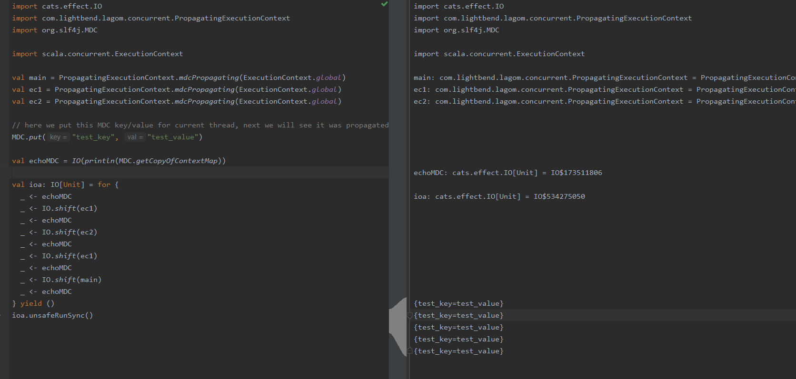

Wrappers on regular execution context to support propagation of the SLF4J Mapped Diagnostic Context (MDC) 

##### MDC propagation between execution contexts


##### Opened for next extensions design
PropagatingExecutionContext is constructed with Seq[ThreadStatePropagator[_]]
```scala
case class PropagatingExecutionContext(delegate: ExecutionContext, propagators: Seq[ThreadStatePropagator[_]])

trait ThreadStatePropagator[S] {
  def threadState: S
  def wrapWithState(runnable: Runnable, state: S): Runnable
}
```
MDCThreadStatePropagator is just one instance of ThreadStatePropagator that is responsible for MDC propagation support
```scala
case class MDCThreadStatePropagator() extends ThreadStatePropagator[java.util.Map[String, String]]
```
It is very easy to implement application specific ThreadStatePropagator's like
- OpenTracing with Spans 
- NewRelic with its Token 
